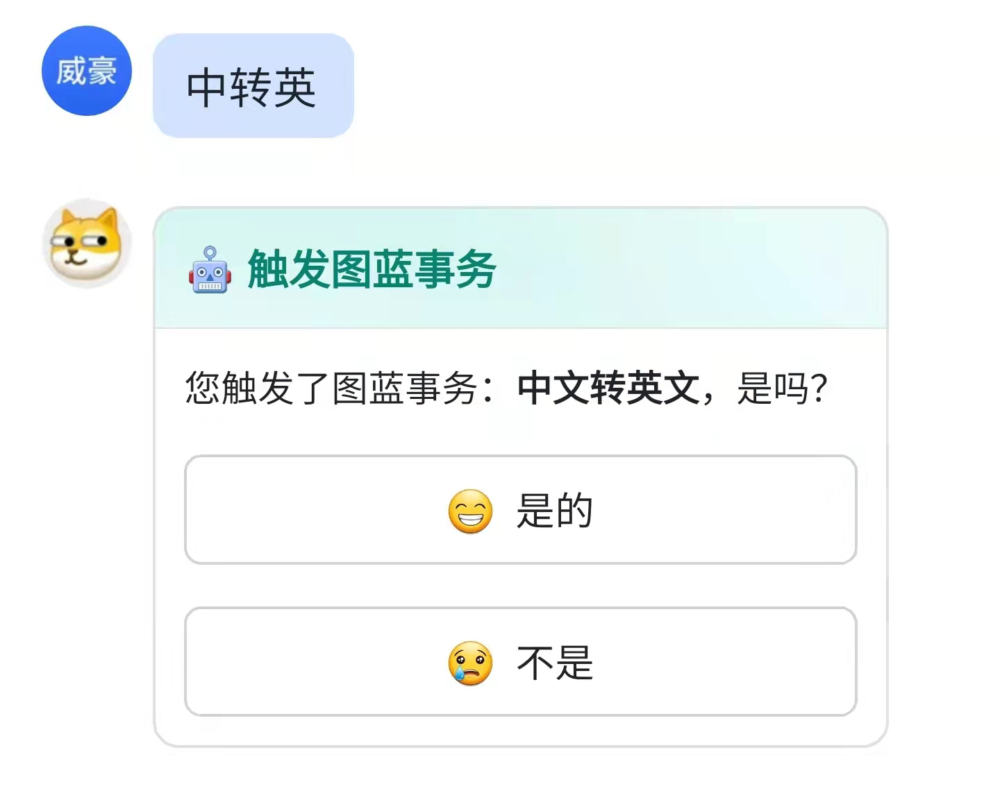

# trigger\_card

`trigger_card`是当用户对机器人发送的消息中包含某个关键词触发了`trigger`后，在正式进入`process`前的确认卡片；下面是一个`trigger_card`的例子：

```json
{
    "config": {
        "wide_screen_mode": true
    },
    "elements": [
        {
            "tag": "div",
            "text": {
                "content": "您触发了图蓝事务：**@@process_name@@**，是吗？",
                "tag": "lark_md"
            }
        },
        {
            "tag": "action",
            "actions": [
                {
                    "tag": "button",
                    "text": {
                        "content": "😁  是的",
                        "tag": "plain_text"
                    },
                    "type": "default",
                    "value": {
                        "key": "trigger_action",
                        "value": "yes"
                    }
                },
                {
                    "tag": "button",
                    "text": {
                        "content": "😢  不是",
                        "tag": "plain_text"
                    },
                    "type": "default",
                    "value": {
                        "key": "trigger_action",
                        "value": "no"
                    }
                }
            ]
        }
    ],
    "header": {
        "template": "turquoise",
        "title": {
            "content": "🤖️ 触发图蓝事务",
            "tag": "plain_text"
        }
    }
    }
```






上方卡片在消息界面呈现的效果：



点击“是的”后，消息卡片会变换为`trigger_confirm_card`：

.png>)

点击“不是”后，消息卡片会变换为`trigger_cancel_card`：

.png>)
